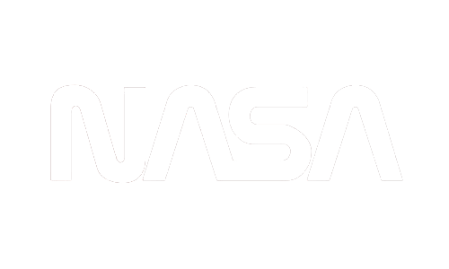

# NASA

## Acerca del proyecto
Diseñamos una aplicación donde representamos a la NASA incluyendo varias páginas con datos de interes informando acerca de la NASA, estadisticas y de igual manera incluyendo una sección de galeria donde se encuentran diversos elementos del espacio con su titulo y descipción el desarrollo es realizado con diferentes tecnologias como: tailwind, css... para construir el diseño.



## Antes de comenzar
1. Ejecutar el siguente comando, para instalar los modulos y administrar las dependencias.
```bash
npm install
```
2. Inicar el proyecto.
```bash
npm start
```
## Integrantes:

Owen Ariel Valle Turcios 

Klisban Rodiney Morales

Aldo Geovanni Osorio Rivera

Cesar Ariel Mejía Gómez 

Gustavo Elias Meza Matute 

Yovany Hernandez Garcia

Patrick David Soto
